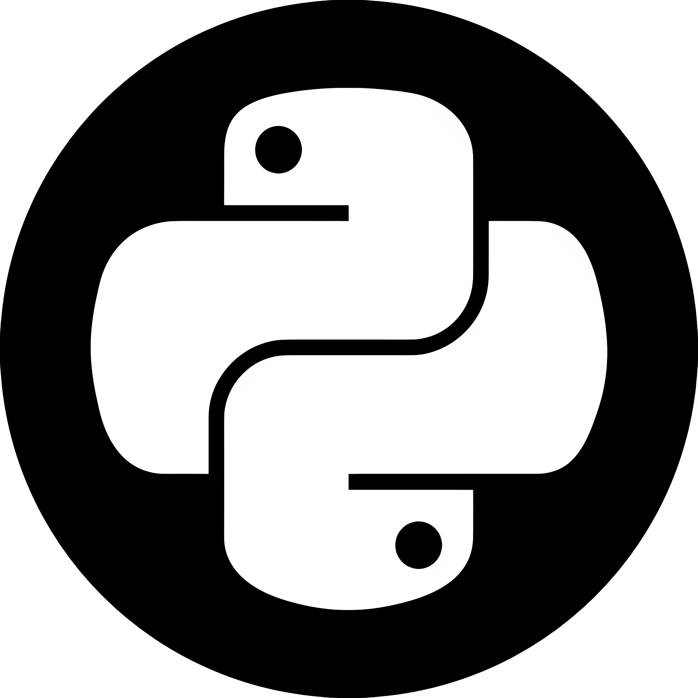

# Guía de Python - DuocUC

<div align="center">
  
  <h1>Guía de Python Interactiva</h1>
  <p>Aprende Python con ejercicios prácticos, quiz y código con syntax highlighting</p>
  <p>
    
    
    
    
    
  </p>
</div>

---

## Descripción

Guía interactiva de Python para estudiantes de DuocUC, reescrita en **Next.js + Tailwind CSS**. Incluye:

- **26 temas** organizados por nivel (principiante, intermedio, avanzado)
- **Laboratorio de sintaxis**: ejemplos de código con resaltado, botón copiar y **descarga de archivos .py**
- **35 ejercicios** con pistas, soluciones y seguimiento de progreso (localStorage)
- **Quiz de 50 preguntas** con explicaciones, modos corto/completo y descarga de resultados
- **PWA instalable**: descarga la app desde el navegador y úsala **offline**
- Modo claro/oscuro, diseño responsivo y 100% en español

## Tecnologías

| Tecnología | Uso |
|------------|-----|
| Next.js 16 (App Router, static export) | Framework y generación del sitio estático |
| Tailwind CSS 4 | Estilos y tema claro/oscuro |
| TypeScript | Tipado del contenido y componentes |
| Prism | Syntax highlighting de Python |
| next-themes | Toggle de tema |
| JSZip | Descarga de ejemplos en .zip |
| Service Worker + Manifest | PWA offline e instalable |
| Cloudflare Pages | Hosting y despliegue automático |

## Estructura

```
src/
├── app/                  # Páginas (App Router)
│   ├── page.tsx          # Inicio
│   ├── temas/            # Temas por nivel
│   ├── sintaxis/         # Ejemplos de código + descargas
│   ├── ejercicios/       # Misiones con soluciones
│   ├── quiz/             # Quiz interactivo
│   ├── recursos/         # Recursos, hoja de ruta y descargas
│   └── manifest.ts       # Manifest de la PWA
├── components/           # Header, Footer, CodeBlock, Starfield, ...
└── lib/
    ├── config.ts         # BASE_PATH y SITE (ajustables por env)
    └── data/             # Todo el contenido (temas, ejemplos, ejercicios, quiz)
```

## Desarrollo local

```bash
npm install
npm run dev        # http://localhost:3000
```

## Build estático

```bash
npm run build      # genera la carpeta out/
npx serve out      # prueba el build localmente
```

El sitio usa `output: "export"`, así que no requiere servidor Node: son archivos estáticos.

## Desplegar en Cloudflare Pages

### Opción 1: Git integration (recomendada)

1. Ve a [Cloudflare Dashboard](https://dash.cloudflare.com) → **Workers & Pages** → **Create** → **Pages** → **Connect to Git**
2. Conecta tu repositorio de GitHub
3. Configura el build:
   - **Build command:** `npm run build`
   - **Build output directory:** `out`
4. Haz clic en **Save and Deploy**

Cada push a `main` se despliega automáticamente.

### Opción 2: GitHub Actions (workflow incluido)

El repositorio incluye `.github/workflows/cloudflare.yml` que despliega con Wrangler. Para usarlo:

1. Crea un token de API en Cloudflare: **My Profile → API Tokens → Create Token → Edit Cloudflare Workers**
2. En el repositorio (Settings → Secrets and variables → Actions) agrega:
   - `CLOUDFLARE_API_TOKEN` → el token creado
   - `CLOUDFLARE_ACCOUNT_ID` → tu Account ID (se ve en la página de inicio de Cloudflare)
3. El workflow crea el proyecto `python-guide` en Cloudflare Pages automáticamente

### Opción 3: Wrangler CLI (manual)

```bash
npm install -g wrangler
npx wrangler login
npm run build
npx wrangler pages deploy out --project-name=python-guide
```

> 💡 **Dominio:** tras el primer despliegue tu sitio queda en `https://python-guide.pages.dev`.
> Si usas un dominio propio, actualiza `NEXT_PUBLIC_SITE_URL` en `src/lib/config.ts` (o como env var) para que el SEO y los metadatos apunten al dominio correcto.

## Variables de entorno (opcionales)

| Variable | Valor por defecto | Uso |
|----------|-------------------|-----|
| `NEXT_PUBLIC_BASE_PATH` | `""` | Prefijo de la app (vacío en Cloudflare; `/python-guide` si algún día vuelves a GitHub Pages) |
| `NEXT_PUBLIC_SITE_URL` | `https://python-guide.pages.dev` | URL canónica para SEO/OG |

## PWA (instalar y usar offline)

- La web es **instalable**: en Chrome/Edge aparece el botón "Instalar App" (o la opción en el menú del navegador).
- El **service worker** (`public/sw.js`) cachea toda la app: funciona sin internet tras la primera visita.
- Cada ejemplo de código se puede **descargar como .py**, y todos juntos como **.zip** desde Sintaxis o Recursos.

## Créditos

**Gabriel Pedreros** — Estudiante de Ingeniería en Informática (DuocUC)

- GitHub: [github.com/gpb-codes](https://github.com/gpb-codes)
- Portafolio: [gpb-codes.github.io/gabrielPedreros/](https://gpb-codes.github.io/gabrielPedreros/)

## Licencia

MIT — ver [LICENSE](LICENSE).
